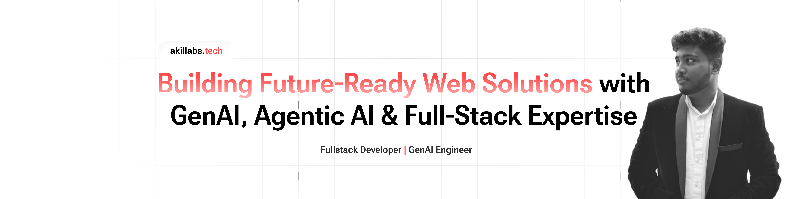

<!-- Header -->

  

<h1 align="center" style="color: black;">Hi there! I'm Akil A 👋</h1>

I am a passionate <b>AI & Full-Stack Developer</b> with expertise in <b>GenAI, LLMs, and Data Science</b>. 
Currently, I am a <b>Junior Software Intern at SNS InnovationHub</b>, working on real-time projects using AI and LLM-based solutions. 
I thrive on building <b>intelligent, scalable, and user-centric applications</b> that simplify complex problems.

<!-- Social Links -->

  

  

  

  

---

<h2 align="center" style="color: #FF4C4C;">Tech Stack</h2>

  
  
  
  
  
  
  
  
  
  
  
  
  
  
  
  
  
  
  
  
  
  
  
  
  
  
  
  
  
  
  
  
  
  
  
  
  
  
  

---

<h2 align="center" style="color: #FF4C4C;">GitHub Statistics</h2>

  
  

---

<h2 align="center" style="color: #FF4C4C;">Activity</h2>

  

---
